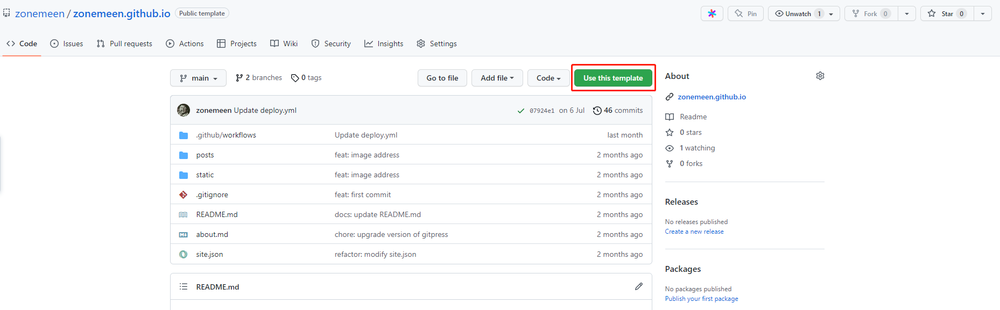
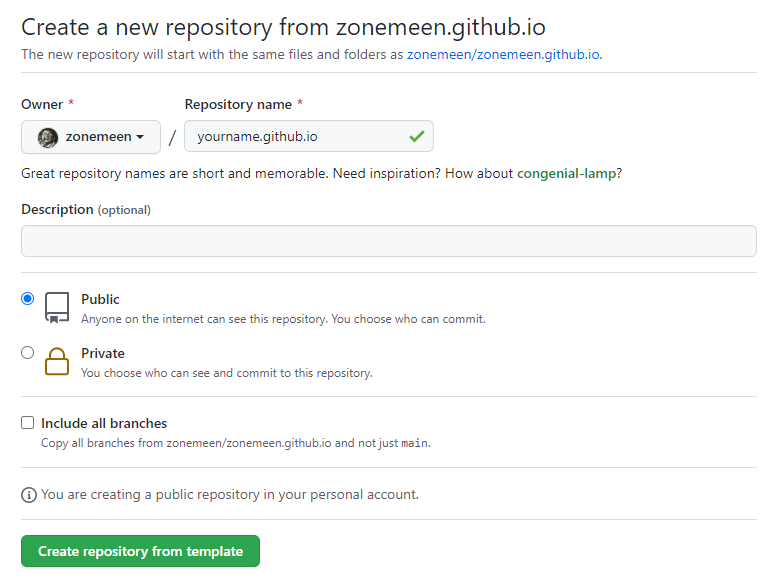

<p align="center">
  
  <h2 align="center">Gitpress</h2>
  <p align="center">Create a minimalist markdown blogging platform via Github Actions<p>
  <p align="center">
    <a href="https://zonemeen.github.io">
    	
    </a>
    <a href="https://github.com/zonemeen/gitpress/blob/main/LICENSE">
    	
    </a>
  </p>
</p>

## Usage Example

- [Codebase](https://github.com/zonemeen/zonemeen.github.io)
- [Blog Website](https://zonemeen.github.io/)
- [简体中文](./README-CN.md)

First visit the template repository at: [zonemeen.github.io](https://github.com/zonemeen/zonemeen.github.io), then click on `Use this template` on the right side of this repository.



Then name the repository according to your `github username`: `yourname.github.io`.



At the bottom are the specific configurations.

## Configure the Blog

Create a repository(deployed via GitHub Pages, usually named yourname.github.io) on GitHub to host your blog, with the following directory structure:

```shell
├── about.md
├── site.json
├── posts
      ├── better-javascript.md
      ├── Vue vs React.md
      └── technique-in-typescript.md
└── static
      ├── resume.pdf
      └── assets
            └── me.jpg
```

### About Page

`about.md` is the markdown file containing the content for your about page.

### Site Configuration

`site.json` contains the configuration of the blog. Given below is the sample JSON configuration.

```json
{
  "title": "zonemeen",
  "subtitle": "I'm a passionate, self-taught, career-changed front-end developer since 2021",
  "owner": {
    "name": "zonemeen",
    "email": "miqilin18@gmail.com"
  },
  "social": [
    {
      "type": "Github",
      "url": "https://github.com/zonemeen"
    },
    {
      "type": "Twitter",
      "url": "https://twitter.com/zonemeen"
    }
  ],
  "seo": {
    "title": "zonemeen's blog",
    "description": "A front-end engineer's article sharing",
    "author": "zonemeen",
    "keywords": [
      "blog",
      "javascript",
      "typescript",
      "passionate",
      "self-taught",
      "career-changed",
      "front-end developer"
    ]
  },
  "cname": "zonemeen.github.io"
}
```

And `cname` is your personal domain if applicable.

### Blog Posts

`posts/` is the directory containing all your blog posts in Markdown format. It supports the following front-matter at the top of each blog post

```shell
---
title: Your first blog on GitHub Pages
date: 2022-06-20
permalink: /first-blog-ghpages
---

Content for your bog post
```

Where `title` is the blog post title shown on the homepage as well as on the artical detail page. `date` is the blog post date. `permalink` is the path to the artical detail page.

### Static Assets

The contents of the `static` folder will be copied at the root of your blog and will be accessible via `http://[blogurl]/filename`

## Configure GitHub Actions

Once you have set up your blog repository, you need to configure the GitHub actions in your repository. Create the GitHub actions automated deployment process file at `.github/workflows/deploy.yml` with the following content

```yaml
name: Build and Deploy
on: [push]
jobs:
  build-and-deploy:
    runs-on: ubuntu-latest
    steps:
      - name: Checkout
        uses: actions/checkout@v3

      - name: Deploy
        uses: zonemeen/gitpress@v1.0.27 # Visit https://github.com/marketplace/actions/gitpress-deploy-blog-action, use latest version 
        with:
          branch: gh-pages # Optional branch for GitHub Pages
```
